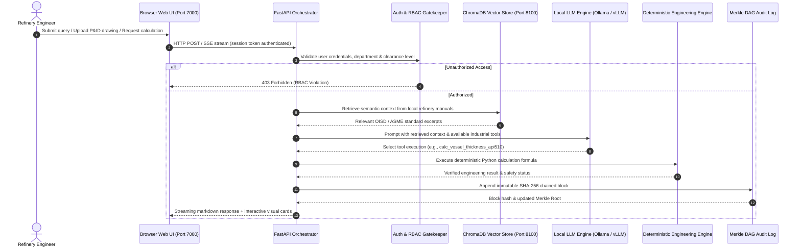

# MRPL Sovereign On-Premise Agentic AI Workbench
### Smart India Hackathon Problem Statement: SIH26117
**Organization:** Mangalore Refinery and Petrochemicals Limited (MRPL) — Ministry of Petroleum & Natural Gas (MoPNG)  
**Project Title:** Sovereign On-Premise Agentic AI Workbench using Open-Weight Multimodal LLMs for Confidential Industrial Operations  
**GitHub Repository:** [https://github.com/Vinayak0928/odin.git](https://github.com/Vinayak0928/odin.git)

---

## 1. Executive Summary & Sovereignty Architecture

Refinery operations in Public Sector Undertakings (PSUs) such as **Mangalore Refinery and Petrochemicals Limited (MRPL)** demand uncompromising data confidentiality, plant safety, and strict statutory compliance (OISD, IBR, CCOE, ASME, API). Commercial cloud AI systems (such as OpenAI, Anthropic, or Microsoft Copilot) require transmitting prompts, proprietary crude assay data, process piping isometric sketches, P&ID schematics, and turnaround shutdown schedules over the public internet to third-party data centers, creating severe corporate espionage and national infrastructure vulnerabilities.

The **MRPL Sovereign Industrial AI Workbench** solves this challenge through a **100% air-gapped, on-premise agentic architecture** powered entirely by **open-weight multimodal foundation models** (e.g., Qwen-2.5-VL, DeepSeek-R1, Qwen-2.5-Coder) running on local compute (Ollama, vLLM, or llama.cpp).

### 1.1 Zero-WAN Air-Gap Boundary
The entire stack operates within a verified zero-WAN boundary. No telemetry, user prompt, calculation input, or engineering document ever leaves the on-premise refinery network.

```
+----------------------------------------------------------------------------------------------------+
|                      MRPL AIR-GAPPED BOUNDARY (0-WAN VERIFIED / ZERO INTERNET)                     |
|                                                                                                    |
|   +--------------------------+       +-------------------------+       +-----------------------+   |
|   |      Browser Web UI      | <---> |    FastAPI Gateway      | <---> |   Local Model Engine  |   |
|   |  - P&ID Drawing Viewer   |       |  - Port 7000            |       |  - Port 11434 (Ollama)|   |
|   |  - Interactive Chat      |       |  - Auth & RBAC Gate     |       |  - Qwen2.5-VL (Vision)|   |
|   |  - Turnaround Manager    |       |  - REST / SSE Streams   |       |  - DeepSeek-R1 (Logic)|   |
|   |  - Merkle Audit Viewer   |       +-------------------------+       |  - Qwen2.5-Coder      |   |
|   +--------------------------+                    |                    +-----------------------+   |
|                                                   v                                                |
|                      +----------------------------------------------------+                        |
|                      |             Agentic Orchestration Core             |                        |
|                      |  - Intent Parser & Execution Coordinator           |                        |
|                      |  - Role-Based Tool Permission Enforcer             |                        |
|                      +----------------------------------------------------+                        |
|                                    /                     \                                         |
|                                   v                       v                                        |
|   +---------------------------------------+       +--------------------------------------------+   |
|   |  Deterministic Industrial Calc Engine |       |    Local Vector Knowledge Base (RAG)       |   |
|   |  - API 510 Pressure Vessel Remaining  |       |  - ChromaDB (Port 8100)                    |   |
|   |  - API 570 Process Piping Inspection  |       |  - FastEmbed / BAAI/bge-m3 ONNX Embeddings |   |
|   |  - API 610 Centrifugal Pump Cavitation|       |  - OISD, ASME, IBR & Refinery Standards    |   |
|   |  - TEMA Shell & Tube Thermal Rating   |       +--------------------------------------------+   |
|   |  - TBP Distillation & Compatibility   |                                                        |
|   |  - OISD-105 Turnaround Scheduler      |                                                        |
|   +---------------------------------------+                                                        |
|                                       \                                                            |
|                                        v                                                           |
|                       +-----------------------------------+                                        |
|                       | Cryptographic Merkle DAG Audit Log|                                        |
|                       | - SHA-256 Tamper-Evident Chaining |                                        |
|                       | - Dynamic Merkle Root Generation  |                                        |
|                       | - Regulatory Forensics (CBI/OISD) |                                        |
|                       +-----------------------------------+                                        |
+----------------------------------------------------------------------------------------------------+
```

---

## 2. System Architecture: How It Works

### 2.1 Complete Architectural Dataflow
The platform bridges non-deterministic LLM reasoning with deterministic engineering calculation engines to eliminate hallucinations in critical refinery decisions.



### 2.2 The 6-Stage Execution Pipeline
1. **Authentication & Clearance Gate:** Every incoming request passes through `core/middleware.py` and `core/auth.py`. The user's active session is verified against SQLite and their departmental role (`OPERATIONS_TAR`, `PROCESS_ENGINEERING`, `RELIABILITY_INSPECTION`, `HSE_SAFETY`, or `EXECUTIVE_MANAGEMENT`) determines accessible tools and document clearance tiers.
2. **Local Vector RAG Query:** If context is required, the query is embedded locally using `fastembed` (ONNX runtime, model `BAAI/bge-m3`) and queried against `ChromaDB` running on port 8100. No external embeddings APIs are invoked.
3. **Agentic Tool Intent Dispatching:** In `src/agent_loop.py`, the system prompts the local open-weight model with strict JSON tool schemas. When calculations or drawing analyses are required, the model invokes one of the registered engineering tools.
4. **Deterministic Calculation Execution:** Mathematical calculations are **never delegated to LLM generation**. Instead, verified formulas in `src/tools/industrial_calc.py` compute exact physical values based on ASME BPVC, ASME B31.3, API 610, and TEMA standards.
5. **Cryptographic Chaining:** The event (prompt, user, department, tool called, parameters, result, and network egress status) is appended to `data/audit_trail.jsonl` using the `MerkleAuditLog` engine in `core/audit_merkle.py`. Each block is hashed using SHA-256 and chained to the previous block hash.
6. **Unified UI Presentation:** The frontend dynamically renders the responses with rich interactive cards, calculation tables, safety badges (e.g., `CRITICAL_RETIREMENT_LIMIT_REACHED`), and tile viewers for high-resolution P&ID inspection.

---

## 3. Core Industrial Intelligence Modules

### 3.1 API 510 Pressure Vessel Integrity & Remaining Life
- **Code Basis:** ASME BPVC Section VIII Division 1 (UG-27) & API 510 In-Service Vessel Code.
- **Formulas:** Circumferential stress minimum required thickness:
  $$t_{\text{min}} = \frac{P \cdot R}{S \cdot E - 0.6 \cdot P}$$
  Where:
  - $P$ = Design internal pressure (psig)
  - $R$ = Inside vessel radius (inches)
  - $S$ = Maximum allowable stress value (psi)
  - $E$ = Joint efficiency factor ($0.0 \le E \le 1.0$)
- **Corrosion Rate & Remaining Life:**
  $$\text{Corrosion Allowance} = t_{\text{actual}} - t_{\text{min}}$$
  $$\text{Remaining Safe Life (years)} = \frac{t_{\text{actual}} - t_{\text{min}}}{\text{Corrosion Rate (in/year)}}$$
- **Statutory Rules Enforced:**
  - Next inspection interval is capped at half the remaining life or a maximum of **10 years** per API 510 §6.5.
  - Automatically flags `CRITICAL_RETIREMENT_LIMIT_REACHED` if $t_{\text{actual}} \le t_{\text{min}}$.

### 3.2 API 570 Process Piping Inspection & Retirement Limits
- **Code Basis:** ASME B31.3 Process Piping & API 570 Piping Inspection Code.
- **Formulas:** Barlow equation for pipe wall thickness under internal pressure:
  $$t_{\text{min}} = \frac{P \cdot D}{2(S \cdot E + P \cdot Y)}$$
  Where:
  - $D$ = Outside diameter of pipe (inches)
  - $Y$ = ASME B31.3 temperature coefficient ($0.4$ for ferritic steels below $900^\circ\text{F}$)
- **Refinery Service Classification & Caps:**
  - **Class 1 (High consequence):** Flammable services that flash off instantly, toxic sour gas ($H_2S$). Next inspection capped at **5 years**.
  - **Class 2:** Most refinery process hydrocarbon streams and hot hydrogen. Capped at **10 years**.
  - **Class 3:** Utility lines (nitrogen, low-pressure steam, water). Capped at **10 years**.

### 3.3 API 610 Centrifugal Pump Hydraulics & Cavitation Prevention
- **Code Basis:** API 610 12th Edition / ISO 13709 & Hydraulic Institute standards.
- **Hydraulics & Friction Head Loss:**
  - Fluid velocity: $v = \frac{Q}{A}$
  - Reynolds number: $Re = \frac{\rho \cdot v \cdot D}{\mu}$
  - Darcy-Weisbach head loss: $h_f = f \cdot \frac{L}{D} \cdot \frac{v^2}{2g}$
- **Net Positive Suction Head Available ($NPSH_a$):**
  $$NPSH_a = \frac{P_{\text{atm}} - P_{\text{vap}}}{\rho \cdot g} + h_s - h_f$$
  Where $h_s$ is static liquid head above the pump centerline.
- **Cavitation Prevention Verification:**
  - Enforces API 610 safety margin: $NPSH_a \ge 1.1 \cdot NPSH_r$ and $NPSH_a - NPSH_r \ge 3.0\text{ ft}$.
  - Identifies cavitation hazard before commissioning pump loops.

### 3.4 TEMA / ASME Shell & Tube Heat Exchanger Rating
- **Thermal Duty:**
  $$Q = \dot{m} \cdot C_p \cdot (T_{\text{in}} - T_{\text{out}})$$
- **Counter-Current Logarithmic Mean Temperature Difference (LMTD):**
  $$\Delta T_1 = T_{h,\text{in}} - T_{c,\text{out}}, \quad \Delta T_2 = T_{h,\text{out}} - T_{c,\text{in}}$$
  $$\text{LMTD} = \frac{\Delta T_1 - \Delta T_2}{\ln(\Delta T_1 / \Delta T_2)}$$
- **Required Heat Transfer Area:**
  $$A = \frac{Q}{U \cdot \text{LMTD}}$$
- Detects **temperature crosses** in refinery crude preheat trains and indicates when multi-pass exchangers or re-sequencing are required.

### 3.5 True Boiling Point (TBP) Distillation Yields & Crude Compatibility (CCI)
- **Crude Assay Blending:** Computes weighted linear blends of API gravity, sulfur content (wt%), and kinematic viscosity across feedstocks (e.g. Arab Light, Basrah Heavy, Maya).
- **Distillation Cut Yields:**
  - **LPG & Light Naphtha:** Cut point $< 150^\circ\text{C}$
  - **Middle Distillates (Kerosene / ATF / Diesel):** $150^\circ\text{C} - 350^\circ\text{C}$
  - **Heavy / Vacuum Gas Oil (VGO):** $350^\circ\text{C} - 540^\circ\text{C}$
  - **Vacuum Residue:** $> 540^\circ\text{C}$
- **Crude Compatibility Index (CCI):** Prevents asphaltene phase precipitation and preheat train fouling during crude slate switches.

### 3.6 OISD-105 Refinery Turnaround & Shutdown Planner
- **Statutory Shutdown Framework:** Generates compliant 7-phase turnaround execution plans:
  1. *Preparation & De-inventorying:* Hydrocarbon pump-out and flare depressurization.
  2. *Nitrogen / Steam Purging:* LEL combustible gas and toxic $H_2S$ clearance testing.
  3. *Mechanical Blinding:* Battery limit spectacle blind swinging and tagging.
  4. *Equipment Overhaul:* Column internal tray cleaning, catalyst dumping, and NDT thickness gauging.
  5. *Hydrotesting & Box-Up:* Inspection sign-offs and vessel closure.
  6. *De-blinding & Leak Testing:* Nitrogen-helium bubble leak testing.
  7. *Commissioning & Startup:* Refined feed cut-in.
- **Automated Blind Lists:** Produces detailed spectacle/slip blind lists, gasket ratings (ASME B16.5 150#/300#/600#), and statutory safety permit checklists under **OISD-105, OISD-156**, and **Factories Act 1948 Section 36**.

### 3.7 Scanned P&ID Drawing Inspection & Computer Vision Pipeline
- **Sliding-Window Tile Decomposition:** High-resolution A0/A1 drawings ($6000\times 4000+$ pixels) are broken down into $1024\times 1024$ tiles with 200px overlap to preserve fine line symbols and text fidelity for local vision models (Qwen-2.5-VL).
- **ISA-5.1 Instrument Tag Extraction:** Automatically recognizes and parses loops:
  - Flow: `FT`, `FIC`, `FCV`, `FE`
  - Pressure: `PT`, `PIC`, `PCV`, `PSV`, `PRV`
  - Temperature: `TT`, `TIC`, `TCV`
  - Level: `LT`, `LIC`, `LCV`, `LG`
- **Automated HAZOP & Safety Auditing:**
  - Detects unprotected pressure vessels lacking emergency Pressure Safety Valves (PSVs).
  - Detects control valves (`FCV`, `PCV`, `LCV`) missing upstream isolation or bypass valves.
  - Verifies process pump suction and discharge isolation valve pairs.

### 3.8 Cryptographic Merkle DAG Audit Trail
- **Structure:** Every action creates a cryptographically signed block with SHA-256 hash linking:
  $$\text{Block Hash} = \text{SHA-256}(\text{Index} \parallel \text{Timestamp} \parallel \text{Action} \parallel \text{User} \parallel \text{Dept} \parallel \text{Egress} \parallel \text{PrevHash} \parallel \text{Payload})$$
- **Merkle Root Computation:** Computes dynamic Merkle DAG tree roots across all recorded blocks.
- **Forensic Verification:** The system verifies the entire hash chain from the genesis block (`0000...0000`) onwards. Any tampering or modification of historical records immediately breaks the chain and triggers tamper alerts during regulatory audits (OISD, PNGRB, CBI).

---

## 4. Departmental Role-Based Access Control (RBAC)

Access to industrial tools and classified documents is enforced through strict role boundaries:

| Department Role | Clearance Level | Permitted Tools & Capabilities |
| :--- | :--- | :--- |
| **OPERATIONS_TAR** | `RESTRICTED_ENGINEERING` | `plan_refinery_turnaround`, `calc_pump_hydraulics`, `calc_heat_exchanger_duty`, `verify_audit_log` |
| **PROCESS_ENGINEERING** | `CONFIDENTIAL_PROCESS` | `optimize_crude_blend`, `calc_heat_exchanger_duty`, `calc_pump_hydraulics`, `verify_audit_log` |
| **RELIABILITY_INSPECTION** | `RESTRICTED_ENGINEERING` | `calc_vessel_thickness_api510`, `calc_pipe_thickness_api570`, `calc_pump_hydraulics`, `inspect_pid_drawing` |
| **HSE_SAFETY** | `CONFIDENTIAL_PROCESS` | `inspect_pid_drawing`, `verify_audit_log`, `calc_vessel_thickness_api510` |
| **EXECUTIVE_MANAGEMENT** | `SECRET_EXECUTIVE` | Full refinery oversight, all engineering calculations, and cryptographic Merkle audit verification |

### Document Clearance Levels:
1. `UNCLASSIFIED`: General plant overview and public datasheets.
2. `RESTRICTED_ENGINEERING`: Standard operating procedures, piping specs, equipment datasheets.
3. `CONFIDENTIAL_PROCESS`: Proprietary crude assay data, catalyst yields, P&ID master schematics.
4. `SECRET_EXECUTIVE`: Refinery turnaround master budgets, critical infrastructure security assessments.

---

## 5. Pruned Consumer Features (Strict Air-Gap Hardening)

To ensure zero external attack surface, strict 0-WAN adherence, and focus on refinery engineering, consumer features present in generic web apps have been excised:
- **Email Subsystem:** IMAP/SMTP mail pollers, composer, accounts, and email inbox routes.
- **Personal Calendar:** CalDAV synchronizers and personal calendar modals.
- **CardDAV Address Book:** Personal contacts management and lookups.
- **Meme / Photo Editor:** Consumer canvas image manipulation tools.
- **Cloud OAuth Logins:** Device-flow logins to OpenAI, Microsoft Copilot, and Claude cloud subscriptions.

---

## 6. How to Run & Quick Start

### 6.1 Prerequisites & System Requirements

| Component | Minimum Requirement | Recommended Specification |
| :--- | :--- | :--- |
| **Operating System** | Windows 10/11, Ubuntu 20.04/22.04/24.04, RHEL 8+, macOS 13+ | Ubuntu 22.04 LTS or Windows 11 Pro |
| **Python** | Python 3.10, 3.11, or 3.12 | Python 3.11 or 3.12 |
| **System RAM** | 8 GB RAM | 16 GB to 32 GB RAM |
| **Local LLM Engine** | [Ollama](https://ollama.com/) (v0.3.0+) or [vLLM](https://github.com/vllm-project/vllm) | Ollama running locally on port 11434 |
| **Hardware Acceleration** | CPU Only (Standard) | NVIDIA GPU (CUDA 12+, 8GB+ VRAM) or Apple Silicon (M1/M2/M3) |
| **Network Access** | Local Loopback (`127.0.0.1`) only | Air-gapped (Zero WAN connectivity) |

### 6.2 Port Allocation Summary

| Port | Service | Description |
| :--- | :--- | :--- |
| **`7000`** | **FastAPI Server / Web UI** | Main refinery workbench portal and REST API |
| **`8100`** | **ChromaDB Vector Store** | Sovereign vector database for RAG document embeddings |
| **`11434`** | **Ollama Local LLM** | Local inference engine serving open-weight models |

---

### 6.3 Method 1: 1-Click Launchers (Easiest)

#### On Windows:
Open a terminal in the project directory:
```powershell
# Option A: PowerShell Launcher (recommended)
powershell -ExecutionPolicy Bypass -File .\launch-windows.ps1

# Option B: Batch File Launcher
.\launch-windows.bat
```
*What the launcher automatically does:*
1. Detects or creates the Python virtual environment (`venv`).
2. Checks and starts ChromaDB on port 8100.
3. Checks dependencies and installs any missing packages from `requirements.txt`.
4. Launches the FastAPI application server on `http://127.0.0.1:7000`.
5. Automatically opens your default web browser to the workbench login screen.

#### On macOS:
```bash
chmod +x ./start-macos.sh
./start-macos.sh
```

---

### 6.4 Method 2: Local Native Run (Step-by-Step)

Follow these steps for a complete manual setup on any OS:

#### Step 1: Navigate to the Repository
```bash
cd odin
```

#### Step 2: Create & Activate Virtual Environment
- **On Windows (PowerShell):**
  ```powershell
  python -m venv venv
  .\venv\Scripts\Activate.ps1
  ```
  *(If script execution is disabled, run: `Set-ExecutionPolicy -Scope Process -ExecutionPolicy Bypass`)*
- **On Windows (Command Prompt):**
  ```cmd
  python -m venv venv
  venv\Scripts\activate.bat
  ```
- **On Linux / macOS:**
  ```bash
  python3 -m venv venv
  source venv/bin/activate
  ```

#### Step 3: Install Core Dependencies
```bash
pip install --upgrade pip
pip install -r requirements.txt
```

#### Step 4: Configure Environment Variables
Copy `.env.example` to `.env`:
- **Windows:**
  ```powershell
  copy .env.example .env
  ```
- **Linux / macOS:**
  ```bash
  cp .env.example .env
  ```

Key configuration keys in `.env`:
```ini
# Strict Air-Gap Enforcement
MRPL_AIRGAP_ENFORCED=true
MRPL_EGRESS_POLICY=0-WAN_STRICT_AIRGAP
ALLOW_EXTERNAL_LLM_APIS=false

# Local LLM Host (Ollama default)
LLM_HOST=localhost
OLLAMA_BASE_URL=http://localhost:11434/v1

# Vector Store
CHROMADB_HOST=localhost
CHROMADB_PORT=8100

# Application Binding
APP_BIND=127.0.0.1
APP_PORT=7000
```

#### Step 5: Start ChromaDB Vector Store
In a separate terminal, launch ChromaDB on port 8100:
- **Windows:**
  ```powershell
  .\run-chromadb.bat
  ```
  *or with PowerShell:*
  ```powershell
  .\run-chromadb.ps1
  ```
- **Linux / macOS / Python CLI:**
  ```bash
  python -m chromadb.cli.cli run --path ./data/chroma --port 8100 --host 127.0.0.1
  ```

#### Step 6: Pull Open-Weight Models Locally
In a separate terminal, pull your preferred open-weight models using Ollama:
```bash
# High-accuracy multimodal vision for P&ID engineering schematics
ollama pull qwen2.5-vl

# Deep reasoning for HAZOP safety logic & turnaround planning
ollama pull deepseek-r1

# Technical code generation & mathematical script execution
ollama pull qwen2.5-coder
```

#### Step 7: Initialize Database & Admin Credentials
Run the initialization script to prepare SQLite tables, directories, and set up your admin user:
```bash
python setup.py
```
Follow the on-screen prompt to set your admin username and password (or use `admin` / your chosen password).

#### Step 8: Start the Workbench Application Server
```bash
python app.py
```
*(Alternatively, run using Uvicorn with reload enabled)*:
```bash
python -m uvicorn app:app --host 127.0.0.1 --port 7000 --reload
```

#### Step 9: Open the Web UI
Open your browser and navigate to:
```
http://127.0.0.1:7000
```
Log in using your admin credentials.

---

### 6.5 Method 3: Containerized Deployment (Docker Compose)

Docker deployment profiles are provided for CPU and GPU architectures:

#### 1. Standard / CPU Container Deployment
```bash
# Build and start services in background
docker compose up -d --build

# Follow logs
docker compose logs -f
```

#### 2. NVIDIA GPU Acceleration (CUDA 12+)
```bash
docker compose -f docker-compose.yml -f docker-compose.gpu-nvidia.yml up -d --build
```

#### 3. AMD ROCm GPU Acceleration
```bash
docker compose -f docker-compose.yml -f docker-compose.gpu-amd.yml up -d --build
```

#### 4. Stopping Containers
```bash
docker compose down
```

Access the application at `http://127.0.0.1:7000`.

---

## 7. Automated Verification & Testing

The repository includes test suites covering calculation accuracy, cryptographic audit integrity, RBAC rules, and P&ID entity parsing.

Run all sovereign industrial test suites using the virtual environment's Python:

```bash
# 1. API 510/570, Pumps, Heat Exchangers, TBP Crude Blending & OISD-105 Turnaround
python -m unittest tests/test_industrial_calc.py

# 2. Cryptographic Merkle DAG Audit Trail & Tamper Detection
python -m unittest tests/test_audit_merkle.py
python -m unittest tests/test_audit_routes.py

# 3. P&ID Drawing ISA-5.1 Inspector & Safety Discrepancies
python -m unittest tests/test_pid_inspector.py

# 4. Departmental Role-Based Access Control (RBAC) & Clearance Levels
python -m unittest tests/test_industrial_rbac.py

# Run all 5 core industrial compliance suites in one command:
python -m unittest tests/test_industrial_calc.py tests/test_audit_merkle.py tests/test_audit_routes.py tests/test_pid_inspector.py tests/test_industrial_rbac.py

# Run full project pytest suite:
pytest tests/
```

Expected result:
```
Ran 21 tests in ~6.7s
OK
```

---

## 8. REST API Reference

The workbench exposes a clean REST API documented interactively via OpenAPI / Swagger at:
- **Swagger UI:** `http://127.0.0.1:7000/docs`
- **ReDoc:** `http://127.0.0.1:7000/redoc`

### Key Industrial Endpoints:

| Endpoint | Method | Description |
| :--- | :--- | :--- |
| `/api/industrial/status` | `GET` | Health status of industrial calculation and vision engines |
| `/api/industrial/api510` | `POST` | Calculates pressure vessel $t_{\text{min}}$, corrosion allowance, and remaining life |
| `/api/industrial/api570` | `POST` | Calculates process piping $t_{\text{min}}$, circuit classification, and inspection cap |
| `/api/industrial/pump-hydraulics` | `POST` | Evaluates pump velocity, friction head loss, $NPSH_a$ vs $NPSH_r$ |
| `/api/industrial/heat-exchanger` | `POST` | Computes exchanger duty $Q$, LMTD, and required area $A$ |
| `/api/industrial/crude-blend` | `POST` | Linear blend optimizer for crude slate API, sulfur, and TBP cut yields |
| `/api/industrial/turnaround-plan` | `POST` | Generates statutory 7-phase OISD-105 shutdown execution schedule |
| `/api/industrial/pid-parse` | `POST` | Parses ISA-5.1 loop tags and performs automated HAZOP discrepancy audit |
| `/api/audit/trail` | `GET` | Retrieves recent cryptographically chained Merkle DAG blocks |
| `/api/audit/verify` | `GET` | Validates hash chain integrity and returns any detected tampering |
| `/api/audit/merkle-root` | `GET` | Computes dynamic Merkle DAG root for external statutory audits |

---

## 9. Troubleshooting & FAQ

### Q1: `powershell: File cannot be loaded because running scripts is disabled`
- **Fix:** Open PowerShell as Administrator or in your current terminal session run:
  ```powershell
  Set-ExecutionPolicy -Scope Process -ExecutionPolicy Bypass
  ```
  Then re-run `.\launch-windows.ps1`.

### Q2: ChromaDB connection error on port 8100
- **Fix:** Ensure ChromaDB is running in the background. Run `.\run-chromadb.bat` or `python -m chromadb.cli.cli run --path ./data/chroma --port 8100`. The application gracefully falls back to keyword search if ChromaDB is offline.

### Q3: How to reset forgotten admin credentials?
- **Fix:** Run `python setup.py` in your terminal. It will detect the existing database and allow you to update the admin password.

### Q4: Model not responding or timing out during chat?
- **Fix:** Check that Ollama is running (`ollama serve`) and the required model has been pulled (`ollama list`). For lower-VRAM systems, use smaller quantizations (e.g., `qwen2.5-coder:7b` or `deepseek-r1:8b`).

### Q5: Can this workbench run in a bunker with 0 internet?
- **Fix:** Yes! Once the Python dependencies and Ollama model weights are copied or cached onto the on-premise machine, the system requires **zero internet access**. Set `MRPL_AIRGAP_ENFORCED=true` in `.env` to enforce complete offline isolation.

---

## 10. Regulatory & Statutory References

- **API 510:** In-Service Pressure Vessel Inspection Code: Maintenance, Inspection, Rating, Repair, and Alteration
- **API 570:** In-Service Piping Inspection Code: Inspection, Repair, Alteration, and Rerating of In-Service Piping Systems
- **API 610 / ISO 13709:** Centrifugal Pumps for Petroleum, Petrochemical and Natural Gas Industries
- **ASME BPVC Section VIII Division 1:** Rules for Construction of Pressure Vessels (UG-27 Thickness Formulation)
- **ASME B31.3:** Process Piping Design Code (Barlow Equation §304.1.2)
- **TEMA Standards:** Tubular Exchanger Manufacturers Association (10th Edition)
- **OISD-STD-105:** Work Permit System for Petroleum Refineries & Oil/Gas Installations
- **OISD-STD-156:** Fire Protection Facilities for Port Oil Terminals and Refineries
- **Factories Act 1948 Section 36:** Precautions Against Dangerous Fumes and Confined Space Entry
- **ISA-5.1:** Instrumentation Symbols and Identification Standard

---

**SIH26117 — Mangalore Refinery and Petrochemicals Limited (MRPL)**  
*Sovereign On-Premise Agentic AI Workbench for Confidential Industrial Operations*
